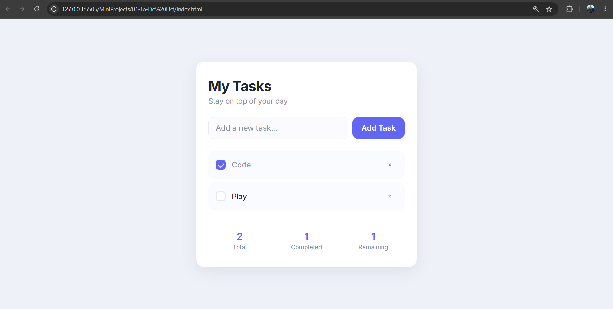

# 📝 To-Do List App

A simple and responsive **To-Do List** application built using **HTML**, **CSS**, and **Vanilla JavaScript**.

The application allows users to add, complete, delete, and persist tasks using the browser's Local Storage.

---

## 📸 Preview

---

## 🚀 Features

* ➕ Add new tasks
* ✅ Mark tasks as completed
* ❌ Delete tasks
* 📊 Live task statistics

  * Total Tasks
  * Completed Tasks
  * Remaining Tasks
* 💾 Data persistence using Local Storage
* 📱 Responsive user interface

---

## 🛠️ Tech Stack

* HTML5
* CSS3
* JavaScript (ES6)
* Local Storage API

---

## ⚙️ How It Works

1. Enter a task in the input field.
2. Click the **Add Task** button to add it to the list.
3. Mark tasks as completed using the checkbox.
4. Delete tasks you no longer need.
5. Task statistics are updated automatically as tasks are added, completed, or deleted.
6. All tasks are saved in Local Storage, so they remain available even after refreshing the page.

---

## 💡 Concepts Practiced & Learned

During this project, I practiced and learned how to:

* Manipulate the DOM to dynamically create, update, and remove task elements.
* Handle user interactions using event listeners.
* Process form submissions using `preventDefault()`.
* Work with JavaScript objects and arrays to manage application data.
* Use query selectors and class manipulation to update the user interface.
* Store application data in the browser using the Local Storage API.
* Convert JavaScript objects to JSON using `JSON.stringify()`.
* Retrieve and restore data using `JSON.parse()`.
* Keep the user interface synchronized with application state and live task statistics.
* Organize code into reusable functions for better readability and maintenance.
* Build a complete CRUD (Create, Read, Update, Delete) application using Vanilla JavaScript.

---

## ▶️ Getting Started

Simply download or clone the repository and open `index.html` in your browser.

---

## 👨‍💻 Author

**Pranjal Charkha**

GitHub: [PCHARKHA](https://github.com/PCHARKHA)
