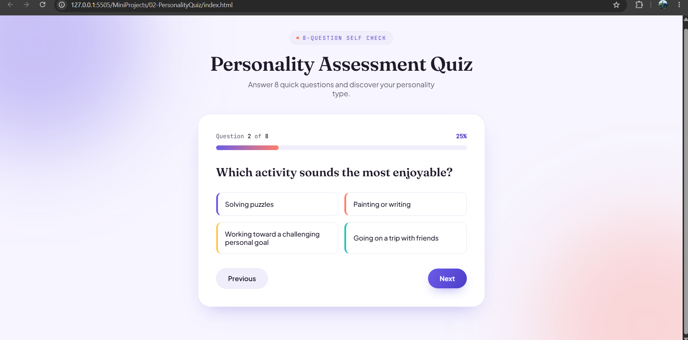
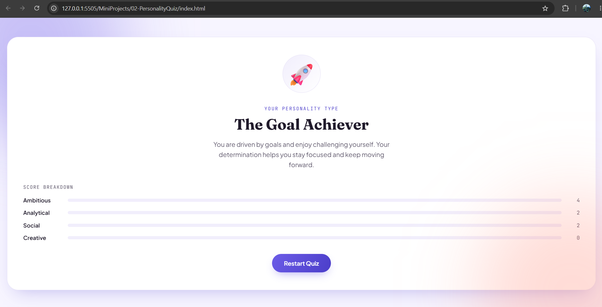

# 🧠 Personality Quiz App

A simple and interactive **Personality Quiz** application built using **HTML**, **CSS**, and **Vanilla JavaScript**.

The application presents users with a series of questions, analyzes their choices, and determines their personality type based on the traits associated with each answer.

---

## 📸 Preview

---

## 🚀 Features

* ❓ Multiple-choice personality questions
* 🎯 Trait-based scoring system
* 📊 Automatic personality result calculation
* 🔄 Restart quiz functionality
* 📱 Responsive user interface
* ⚡ Dynamic question loading using JavaScript

---

## 🛠️ Tech Stack

* HTML5
* CSS3
* JavaScript (ES6)

---
## ⚙️ How It Works

1. The quiz loads the first question.
2. The user selects one of the available options.
3. Each selected option increases the score of its associated personality trait.
4. The next question is displayed automatically.
5. After all questions are answered, the application calculates the highest-scoring trait.
6. The final personality result is displayed.
7. The user can restart the quiz and try again.

---
## 💡 Concepts Practiced & Learned

During this project, I practiced and learned how to:

* Manipulate the DOM to create an interactive user interface.
* Dynamically create and update HTML elements using JavaScript.
* Handle user interactions with event listeners.
* Store and organize quiz data using JavaScript arrays and nested objects.
* Use loops (`forEach`) and conditional statements to control application flow.
* Manage application state by tracking user responses and scores.
* Work with JavaScript objects as counters for personality traits.
* Organize code into reusable functions for better readability and maintenance.
* Build a complete interactive web application using Vanilla JavaScript.

## ▶️ Getting Started
Simply download or clone the repository and open `index.html` in your browser.

## 👨‍💻 Author
**Pranjal Charkha**
GitHub: [PCHARKHA](https://github.com/PCHARKHA)
