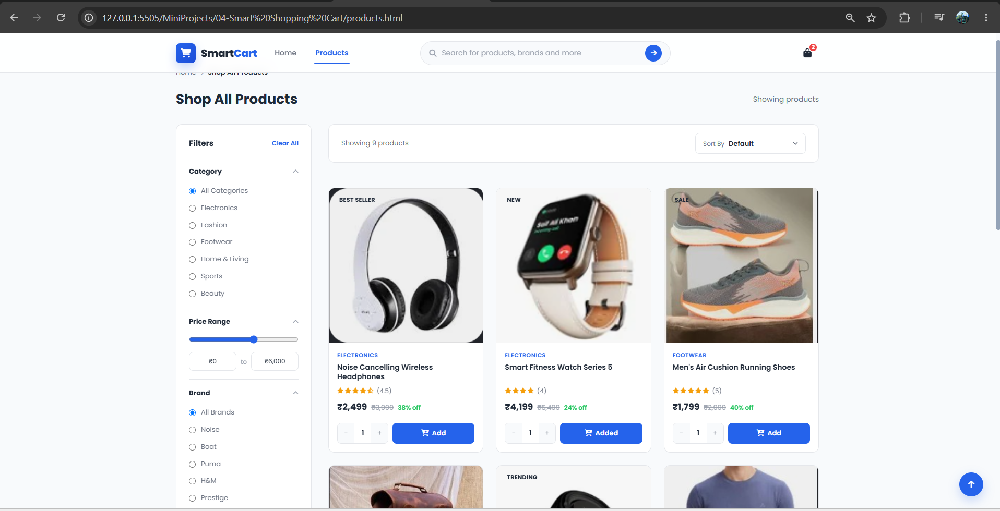
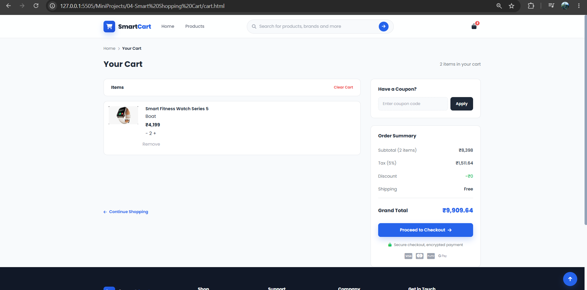

# 🛒 SmartCart

A simple and interactive **e-commerce shopping cart** built using **HTML**, **CSS**, and **Vanilla JavaScript**.

The application provides a complete frontend shopping experience with dynamic product rendering, search, filtering, sorting, cart management, coupon discounts, and order summary calculations.

---

## 📸 Preview






---

## 🚀 Features

- 🛍️ Dynamic product rendering
- 🔎 Product search functionality
- 🗂️ Product filtering by category and brand
- 🔤 Sort products from A–Z
- 🛒 Add products to cart
- ➕ Increase and decrease product quantity
- 🗑️ Remove individual cart items
- 🧹 Clear entire cart
- 💾 Cart persistence using `localStorage`
- 🎟️ Coupon and discount system
- 🚚 Free shipping based on order value
- 💰 Automatic subtotal, tax, shipping, discount, and grand total calculation
- 📊 Dynamic cart item count
- 📱 Responsive user interface
- 🔝 Back-to-top functionality

---

## 🛠️ Tech Stack

- HTML5
- CSS3
- JavaScript (ES6 Modules)
- Browser `localStorage`

---

## ⚙️ How It Works

1. Product information is stored in `data.js`.
2. `products.js` dynamically renders the available products.
3. Users can search, filter, and sort products.
4. When a product is added to the cart, its ID and quantity are stored using `localStorage`.
5. `cart.js` retrieves the stored cart and matches each product ID with the product data.
6. Users can modify quantities, remove items, or clear the cart.
7. The order summary automatically calculates subtotal, tax, shipping, discounts, and grand total.
8. `coupons.js` handles coupon validation and discount logic.
9. `utils.js` contains reusable calculation and helper functions.
10. `app.js` handles site-wide functionality such as navigation, search, cart count, and back-to-top behavior.

---

## 📁 Project Structure

```text
SmartCart/
│
├── index.html
├── products.html
├── cart.html
│
├── css/
│   ├── global.css
│   ├── navbar.css
│   ├── products.css
│   ├── cart.css
│   ├── components.css
│   └── responsive.css
│
├── js/
│   ├── data.js
│   ├── utils.js
│   ├── storage.js
│   ├── products.js
│   ├── coupons.js
│   ├── cart.js
│   └── app.js
│
└── assets/
    └── images/

💡 Concepts Practiced & Learned

During this project, I practiced and learned how to:

Manipulate the DOM to dynamically create and update product and cart elements.
Handle user interactions using event listeners.
Work with JavaScript ES6 modules using import and export.
Separate application logic into multiple JavaScript modules.
Use localStorage to persist cart data.
Work with JavaScript arrays and array methods such as find(), filter(), reduce(), sort(), and forEach().
Implement search, filtering, and sorting functionality.
Implement event delegation for dynamically generated elements.
Create reusable utility functions for calculations and DOM operations.
Implement a coupon system using different coupon types.
Use custom events for communication between JavaScript modules.
Build a complete multi-page e-commerce frontend using Vanilla JavaScript.
Organize JavaScript code into separate modules following a cleaner project structure.

▶️ Getting Started
Simply download or clone the repository and open index.html in your browser.
Since the project uses JavaScript ES6 modules, run it through a local development server if your browser blocks module loading when opening the HTML file directly.

👨‍💻 Author

Pranjal Charkha

GitHub: PCHARKHA
