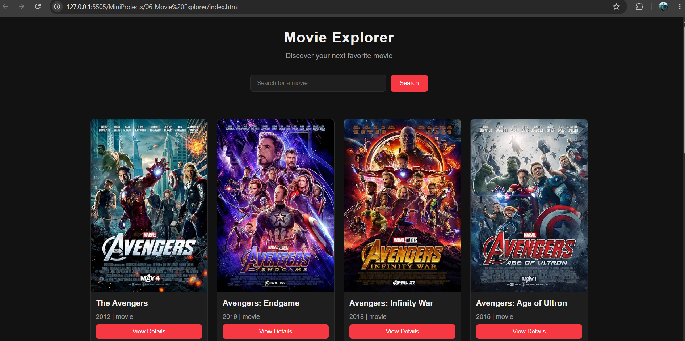
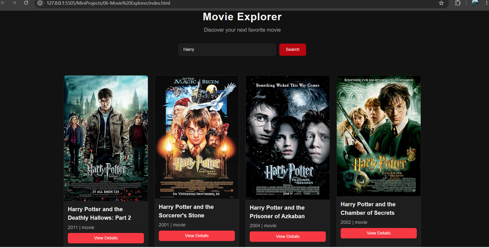
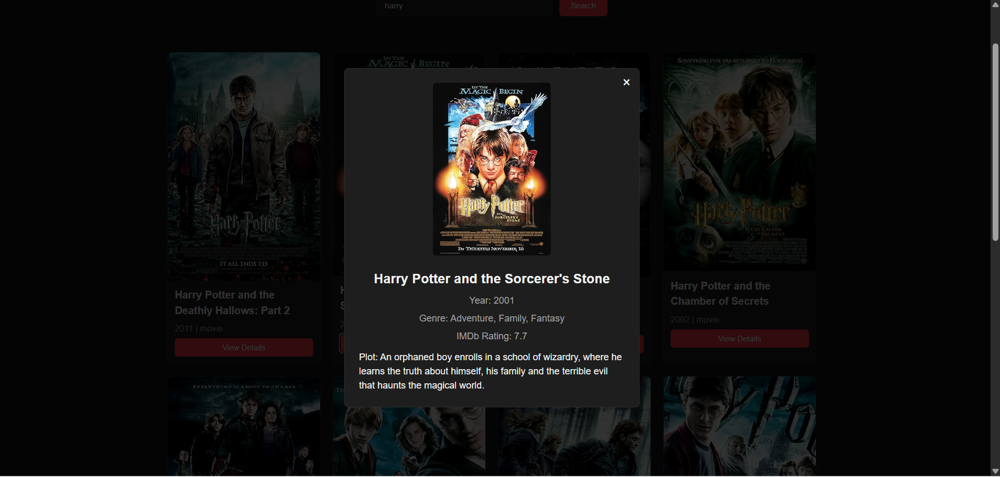

# 🎬 Movie Explorer

A simple and interactive **movie search and discovery application** built using **HTML**, **CSS**, and **Vanilla JavaScript**.

The application uses the **OMDb API** to search for movies, display search results, and fetch detailed information about individual movies. It also demonstrates asynchronous JavaScript using `fetch()`, Promises, `async/await`, and error handling.

---

## 📸 Preview





---

## 🚀 Features

* 🎬 Search movies using the OMDb API
* 🔎 Dynamic movie search results, movie poster rendering
* 📅 Display movie year and type
* 📖 View detailed movie information
* ⏳ Loading and status messages
* ❌ Error handling for failed API requests
* 🔐 API response validation
* 🪟 Movie details modal
* 🌐 Fetch data from a REST API
* 📱 Responsive user interface

---

## 🛠️ Tech Stack

* HTML5
* CSS3
* JavaScript (ES6)
* Fetch API
* Promises
* `async/await`
* OMDb API

---

## ⚙️ How It Works

1. The user enters a movie name in the search input.
2. `searchMovies()` validates the input and starts the search process.
3. `fetchMovies()` sends an HTTP request to the OMDb API using `fetch()`.
4. The response is converted from JSON using `response.json()`.
5. The application checks the API response before displaying the results.
6. `displayMovies()` dynamically creates movie cards from the returned data.
7. Each movie card contains its IMDb ID using a `data-movie-id` attribute.
8. When the user clicks **View Details**, the movie's IMDb ID is retrieved using `dataset`.
9. `getMovieDetails()` makes another API request to retrieve detailed movie information.
10. `displayMovieDetails()` updates the existing details section with the movie information.
11. `showStatus()` handles loading, error, and empty-state messages.
12. `loadFeaturedMovies()` displays an initial set of movies when the application loads.

---

## 📁 Project Structure

```text
MovieExplorer/
│
├── index.html
├── style.css
├── script.js
│
└── assets/
    └── images/
```

---

## 💡 Concepts Practiced & Learned

During this project, I practiced and learned how to:
* Make HTTP requests using the Fetch API.
* Understand and work with JavaScript Promises.
* Use `async` and `await` for asynchronous operations.
* Handle asynchronous errors using `try...catch`.
* Use `.json()` to process API responses.
* Validate HTTP responses using `response.ok`.
* Handle API-level errors using response data.
* Implement Promise-based API workflows.
* Use `data-*` attributes and `dataset`.
* Implement event delegation for dynamically generated buttons.
* Dynamically render movie cards using JavaScript.
* Fetch additional information based on an IMDb movie ID.
* Build a complete API-based frontend project using Vanilla JavaScript.

---

## 🌐 API

This project uses the **OMDb API** to retrieve movie information.
The application uses  API request:
```text
Search movies
    ↓
OMDb API
    ↓
Search results
```

## ▶️ Getting Started
Simply download or clone the repository and open index.html in your browser.
Since the project uses JavaScript ES6 modules, run it through a local development server if your browser blocks module loading when opening the HTML file directly.

## 👨‍💻 Author

**Pranjal Charkha**

GitHub: PCHARKHA
